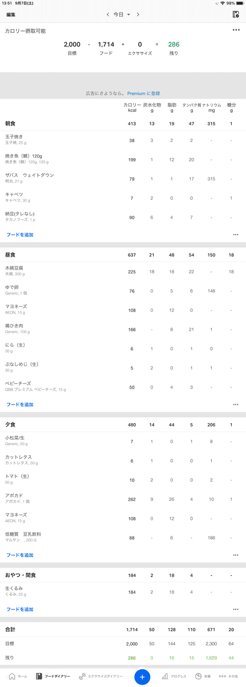
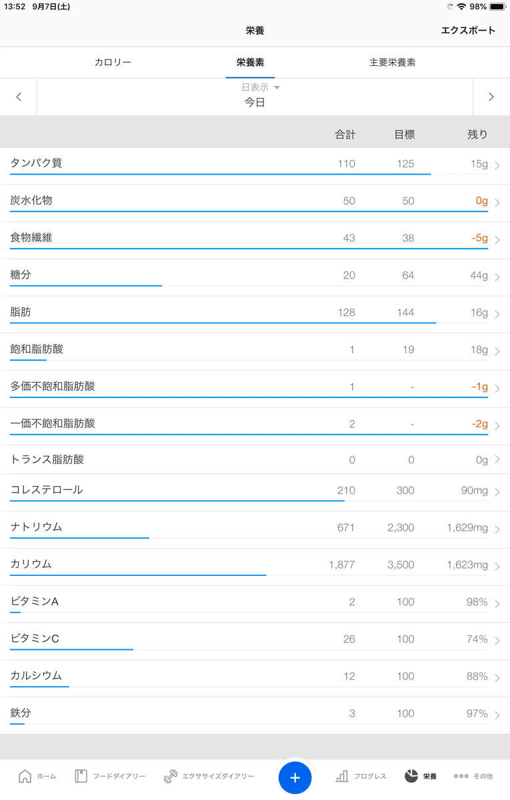
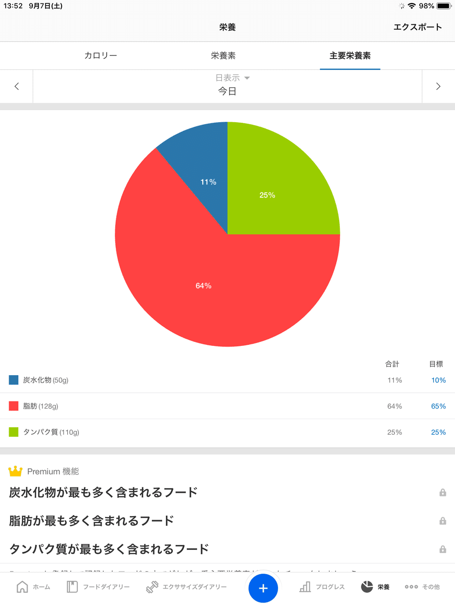
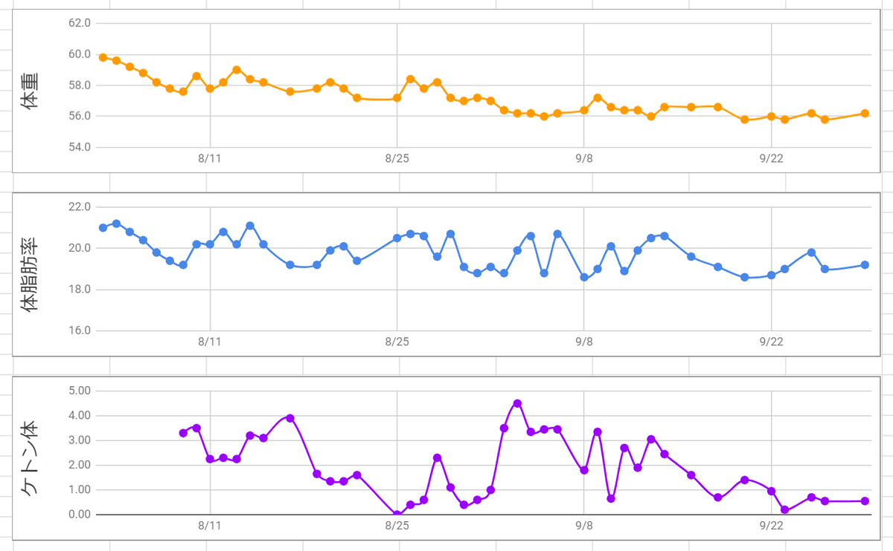

社会人になったときは54kgだった体重が61kgまで増えてしまい、さすがにまずいなぁと思いつつ何もしないままでいましたが、親知らずを抜かなければならない状況になってしまったので、どのみち食べたいように食べられなくなるのならと、ついでに糖質制限ダイエットを始めてみました。

<!-- truncate -->

## スケジュール

8/2と8/30が親知らず抜歯の日だったため、下記のようにスケジューリングしてみましたた。

- 8/3～8/10 ケトジェニック
- 8/11～8/22 ローカーボ
- 8/23～8/25 通常 ※海外旅行に行っていたため
- 8/26～8/30 ローカーボ
- 8/31～9/7 ケトジェニック
- 9/8～9/30 ローカーボ

## ケトジェニックとローカーボ

ケトジェニックもローカーボも糖質制限であることには変わりないが、趣旨は少し変えてます。

### ケトジェニック

ケトジェニックでは糖質を極限まで減らすことで身体を慢性的に糖不足の状態にし、普段は非活性になっている糖新生の仕組みを起動して糖を作り出しエネルギーとします。（ケトーシス状態）  
この際、体内の内臓脂肪を燃焼します。つまり脂肪を燃焼しやすい身体を作ることにあります。

気をつけたこととしては

- カロリー不足にならないようにする
- 加工食品は極力使用せず原型に近いものを摂取する
- 気にしていないと、あっという間に糖質摂取量が基準値を超えてしまうため、食事メニューは固定する
- 身体への負担もそれなりにあるため、期間は1回あたり1週間までとする

あたりです。

食事メニューはこんな感じにしました。

食事メニュー

食事メニュー計算にはカロミルというアプリを使用しました。

[https://apps.apple.com/jp/app/rong-yang-guan-li-daiettosns/id963055562](https://apps.apple.com/jp/app/rong-yang-guan-li-daiettosns/id963055562)

[https://play.google.com/store/apps/details?id=com.calomeal.android](https://play.google.com/store/apps/details?id=com.calomeal.android)

市販品もそれなりに登録されており、組み合わせを計算するのに捗りました。

栄養素とPFCバランスはこんな感じになります。

栄養素

PFCバランス

### ローカーボ

ローカーボでは現代生活で過剰摂取になりがちな糖質を控え、その分を他の栄養で補うことで体内にエネルギーが貯蔵されないようにします。つまり健康的な食生活を習慣化することにあります。

気をつけたこととしては

- 急激に血糖値を上昇・下降させる食品（GL値の高い食品）を控える
- 急激に血糖値を上昇させる食べ方（早食いなど）をしない
- 夜遅くに食事・間食をしない
- 食事に際しては禁止食品と非推奨食品のみ定め、他は自由に摂取してよいが、常にPFCバランスは意識する

です。更に、今回は下記のものを禁止としました。

- 清涼飲料水全般（無糖除く）
- 菓子類全般（ただし、チョコレート効果カカオ95%を除く）
- 米、及び米製品全般
- 小麦、及び小麦製品全般

そのほか、果物全般（アボカド除く）を非推奨食品としました。

なので、基本的には豆腐やじゃがいも、糖質0g麺を主食にしていました。

[https://www.kibun.co.jp/brand/toshitsuzerogmen/](https://www.kibun.co.jp/brand/toshitsuzerogmen/)

## やってみた結果

体重：59.8kg → 56.2kg (-3.6kg)  
体脂肪率：21% → 19.2% (-1.8%)

2ヶ月でだいたい4kg弱の減量に成功しました。

## さらに１ヶ月後

糖質は少し控えめ（150gくらい）で継続進行中です。  
体重は55.5kgくらいになっています。
