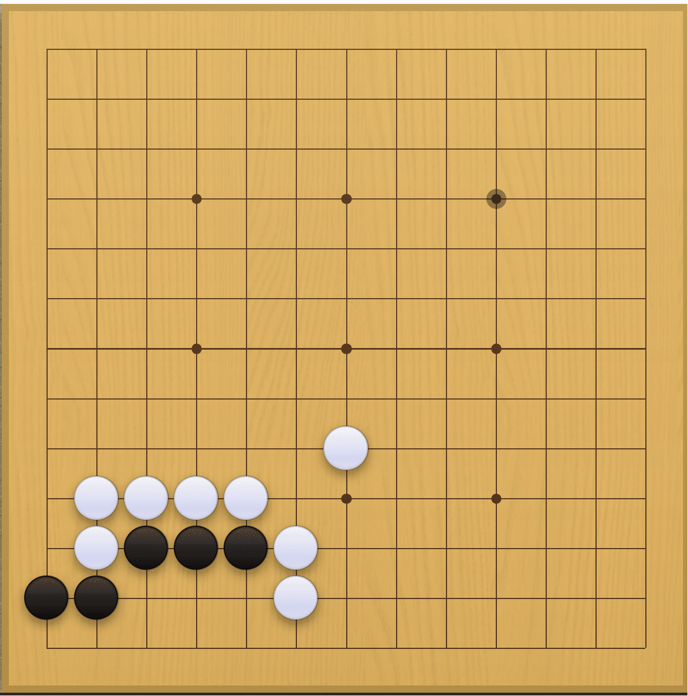
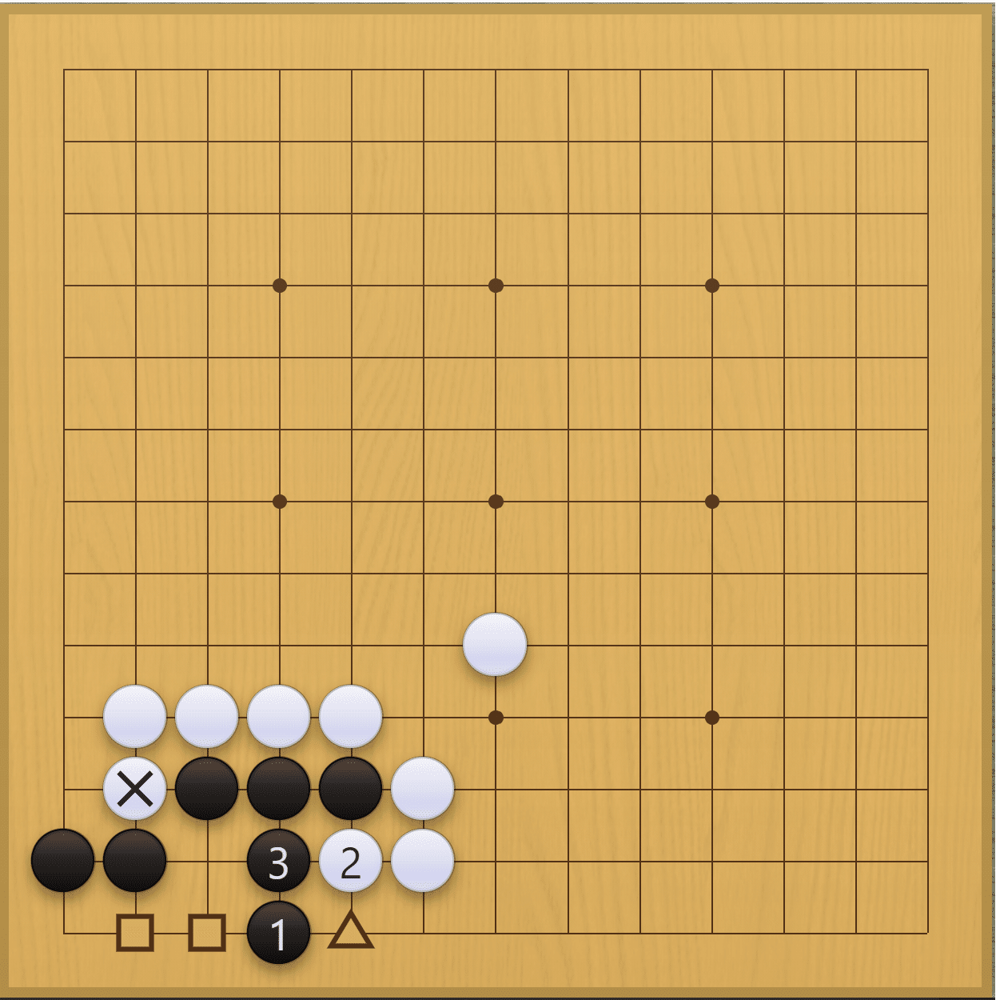
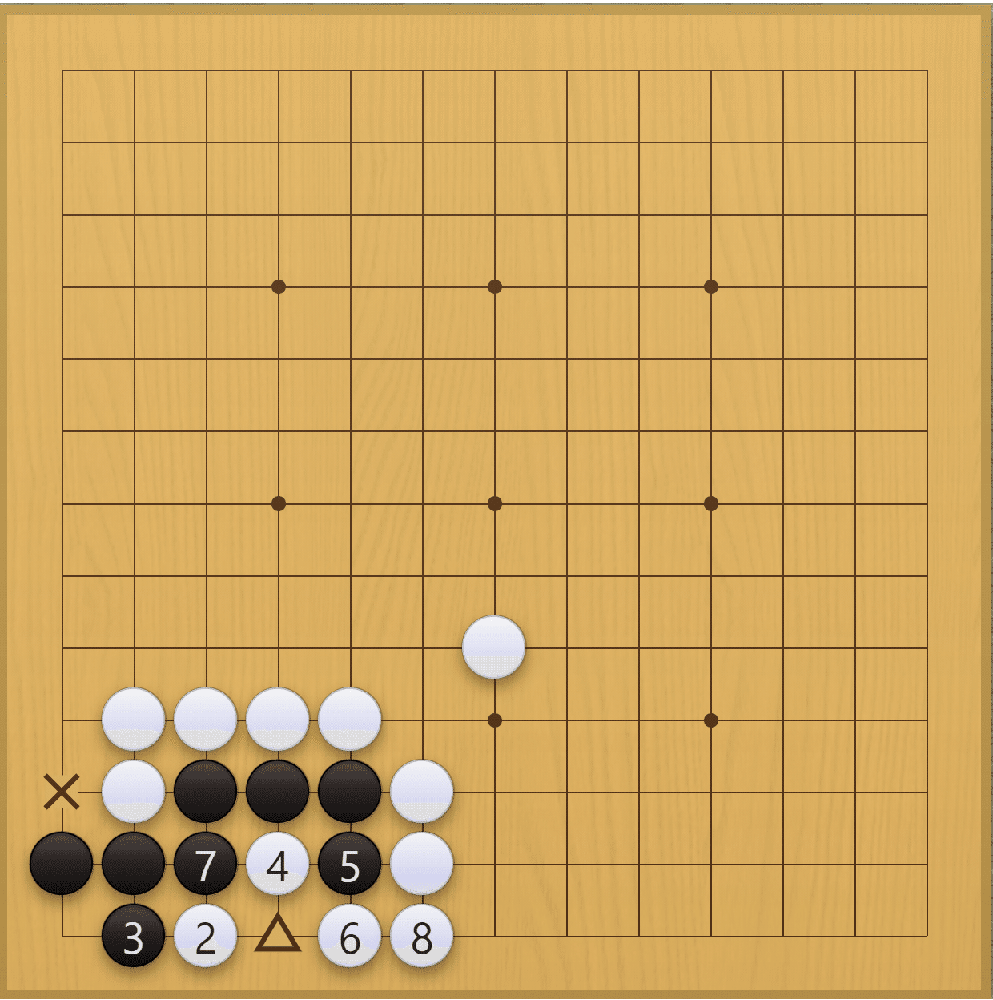
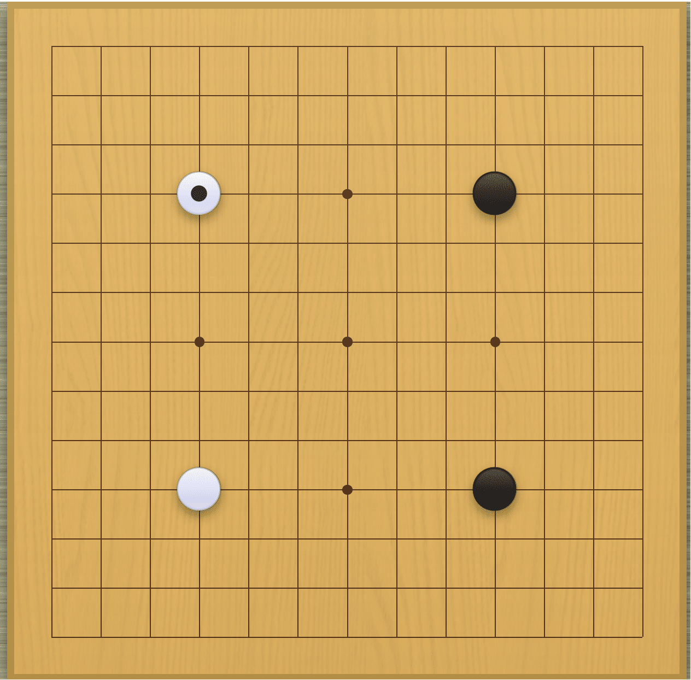
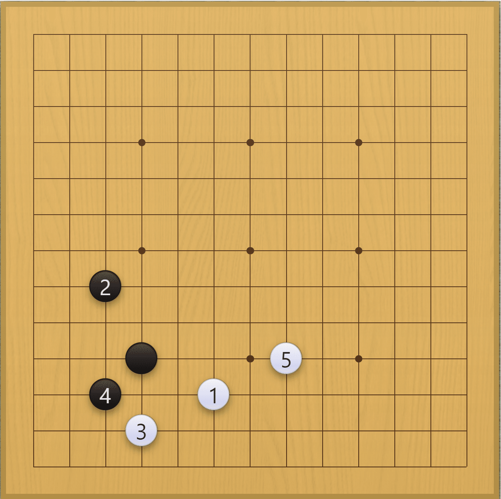
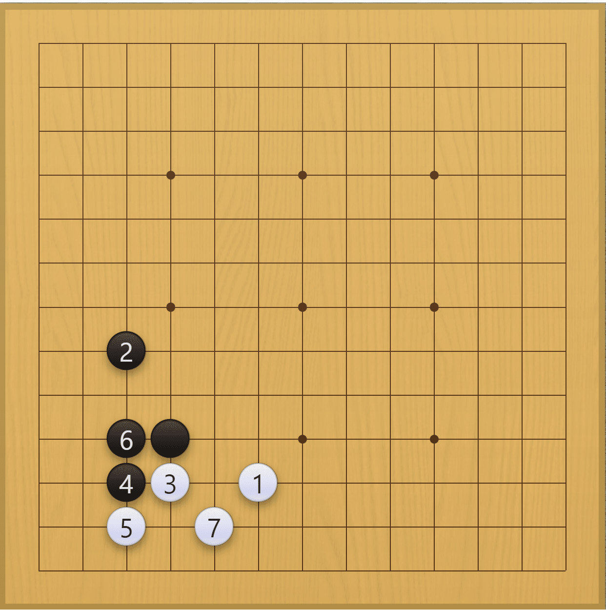
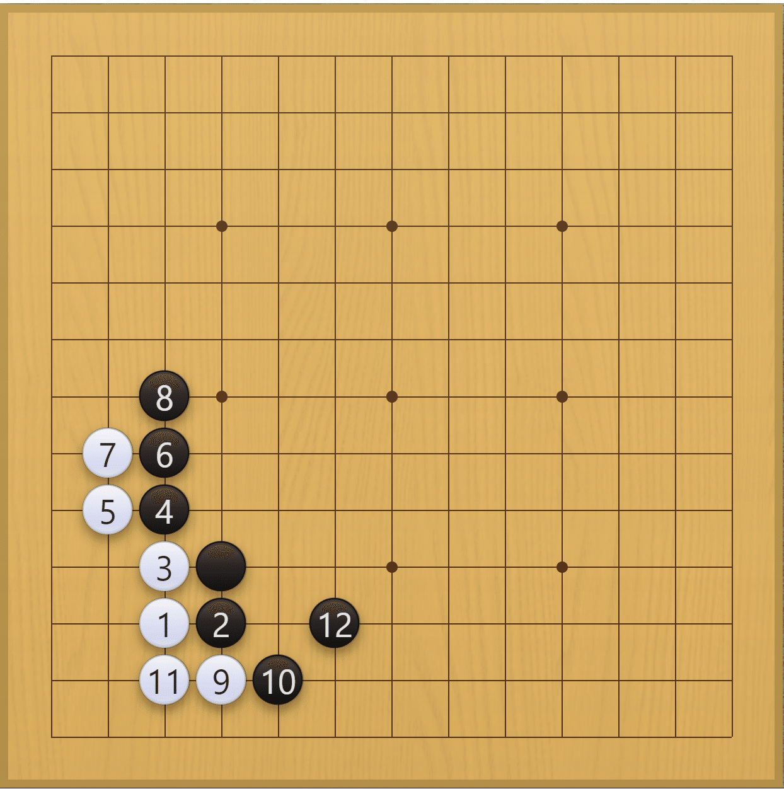
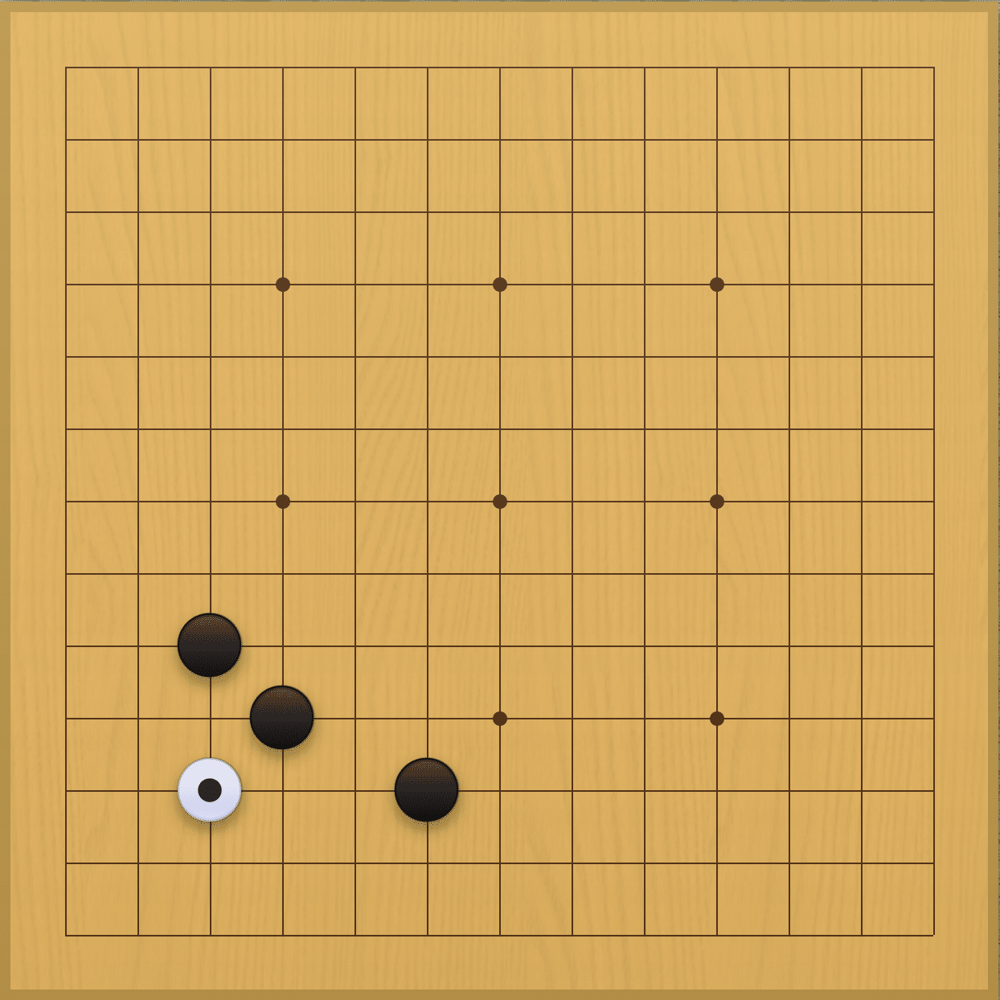
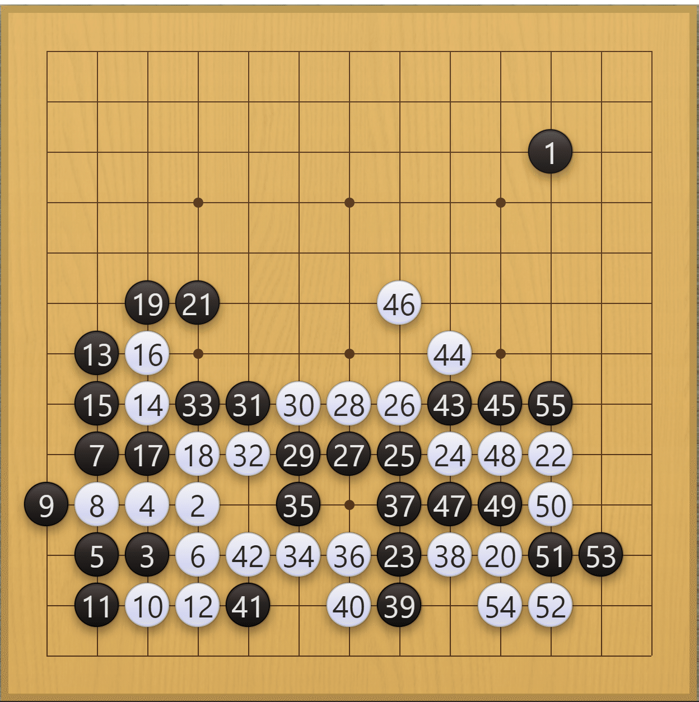

囲碁クエストを初めて約1年、レート1300～1400をうろうろしている時期が長かったのですが、いよいよレート1500に到達し、一旦の目標を達成できたので、それまでにやってきたことを振り返ってみます。

<!-- truncate -->

## 易しい詰碁・手筋問題を毎日解く

19路盤と違い、9路盤や13路盤は序盤が短いため、すぐに戦いになります。そのため、詰碁・手筋に似た形が出やすく、効果を実感し易かったです。

私の場合は、詰碁プロのフリーパス(1,500円)を買い、レベル1の問題（全950問）を毎日50問ずつ解いています。

[https://apps.apple.com/jp/app/%E8%A9%B0%E7%A2%81%E3%83%97%E3%83%AD/id892041876](https://apps.apple.com/jp/app/%E8%A9%B0%E7%A2%81%E3%83%97%E3%83%AD/id892041876)

サイクルとしては、こんな感じです。

- 1日目 1～50問目をそのまま解く
- 2日目 1～50問目を反対側から見て解く
- 3日目 1～50問目を横側から見て解く
- 4日目 51～100問目をそのまま解く
- 5日目 …

特に、同じ問題を、見る方向をを変えながらやることが大切です。1年も続けていると、どの問題もパッと見で手順が分かる状態になりました。そして、それができるようになると、実戦でも、**自分が打った後に次に相手がどこに打ってきそうか予想ができる**ようになってきました。

### 易しい問題のレベルとは

問題のレベルとしてはこれくらいのものです。黒先黒生です。

手筋問題 #219より

アプリにある解答です。

手筋問題 #219 解答

ちなみに、アプリで示されている解答はここまでですが、白×によって黒石が完全には繋がっておらず、ダメが詰まっているので、**△に白石が来たら□のどちらかに手入れして二眼にする必要がある**ことも覚えました。

ところで、相手もこの手順を知っている場合、白2で変化してくる可能性があるので、こういった変化も覚えました。

手筋問題 #219 別解

この後、黒△で生きです。なお、×に白石があると黒7が打てないので黒先でも黒死です。このように**ダメが空いているか空いていないかでも結果が変わってしまう**ことにも気をつけて詰碁を解いています。

## 布石を決めて打つ

布石は、黒番でも白番でも二連星を多用しています。

二連星

小目と星、とか、小目と小目の組み合わせでもいいのかも知れませんが、とにかく**布石を1つ決めて打つ**ようにしています。

その中でも、私が二連星を好んで打つのは、下記の理由です。

- その後の打ち方がわかりやすい
- 黒番でも白番でも使いやすい
- 三三入りへの対応の練習になる

### 星の定石を覚える

星のその後の打ち方は変化が少ないので打ちやすいと思っています。普段は下記の定石を使っています。

カカリ受け①

カカリ受け②

三三入り①

三三入り②

特に星打ちにとって三三入りは悩ましい課題ですが、三三に入られたときの打ち方を練習できるので、その経験値が貯まるのは大きかったです。

## 隅の基本死活を覚える

13路盤は、19路盤に比べ辺や中央の面積比率が小さいため、隅の基本死活（6目、7目、8目）が役に立ちました。

[https://www.h-eba.com/heba/JITEN/jiten1-0.html](https://www.h-eba.com/heba/JITEN/jiten1-0.html)

- 6目、7目先手は確実に殺せるようにする
- 8目は確実に生きられるようにする

特に、星＋ケイマ＋コスミに対して三三に入ってきた場合、その後、相手がどんな変化をしてきても必ずナカデにして殺せるようになりました。

星＋ケイマ＋コスミに三三入り

今までは、優勢であっても、こういった**無理手・勝負手を殺せなくて逆転されてしまっていた**のですが、そういったことがなくなり、勝てるようになりました。

## 対局後に振り返りをする

負けた勝負は必ず振り返りを行い、自分なりに**問題点を1つ考えてみる**ようにしています。

実際にはもっとたくさんの問題があると思いますが、そもそも全てに気付けるかどうか怪しいですし、そもそも振り返りが苦痛になってしまっては意味がないので、まずは1つ考えてみることで気楽に振り返りを続けられるようにしています。

以下は過去の対局で、自分が白番です。黒55で投了しました。

自分が白番の対局

黒5のサガリは普通は黒6とするところなので、白6のマガリが打てたのはラッキーで、はっきり優勢を感じました。というのも、黒は封鎖され隅に二眼ないので、生きるためには二線を這って左上隅に逃げるしかありません。なので、それを攻めている間に強固な厚みを築いて右辺に展開できると思いました。

白20,22で左下隅を地にしながら下辺を地模様にしました。白は黒1へ圧力をかけられることを考えると、下辺がそのまま地になると黒番の負けがほぼ確定してしまいます。そう思うと、白が強いところに打ち込んできた黒23はおそらく勝負手で、これを殺すことができれば白の勝ちを揺るぎないものにすることができると思います。

しかし、そこから難しい戦いなり、黒55で4子を取られ大逆転されてしまいました。白54は白20,38を取られることを嫌ったものですが、後で調べたところ、白53の下に打てば、白20,38を取られてもシボってダメヅマリに導く手があったようでした。

ただ、これは手順が難しいので、白34で白35とするのが分かりやすかったかなと思います。ダメを詰めつつ二眼作れるので、その後の戦いが簡明になったと思います。なので、**優勢のときには難しい手順にならないように打つように心がける**ようにしました。

上記は一例ですが、このような振り返りを繰り返すことで徐々に強くなれた気がします。

次なる目標はレート1700です。レート1300～1400あたりで行ったり来たりしている方の参考になれば幸いです。
