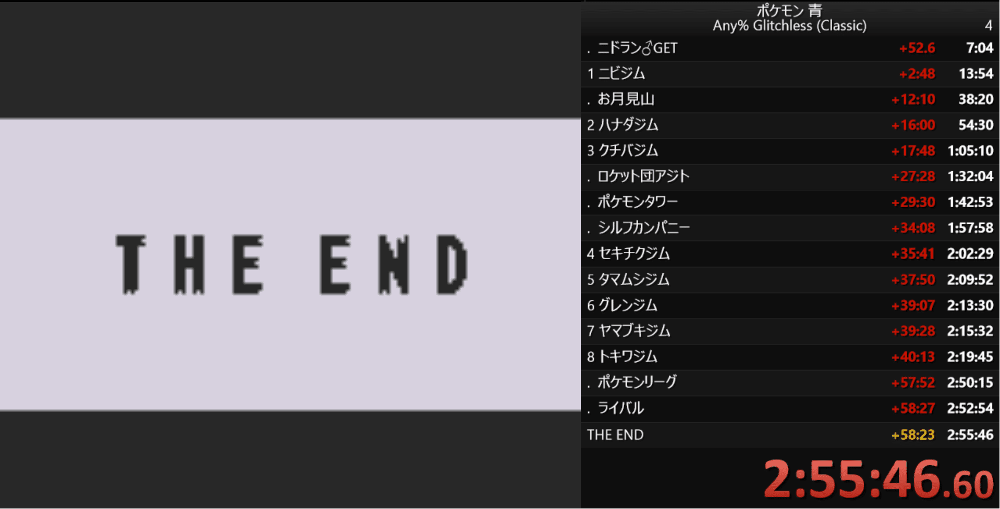

昨年末に RTA in Japan Winter 2023 が開催されていました。

[https://rtain.jp/rtaij/rta-in-japan-winter-2023/](https://rtain.jp/rtaij/rta-in-japan-winter-2023/)

RTA in Japan 2 が行われていた頃にファンになり、そこからイベントが開かれる毎に配信を見ていたのですが、今まで自分でやってみることはありませんでした。

しかし、年末年始中に何か新しいチャレンジをしてみようと思い、今回RTAに挑戦してみたので、そのレポートとなります。

<!-- truncate -->

## RTAとは

Real Time Attack の略で、簡単に言えばゲームの早解きの時間を競うものです。（RTAは和製英語で、英語圏ではSpeedrunと呼ばれています）

"Real" とついていますが、通常のTime Attackがゲーム内での時間記録を競うものであるのに対し、RTAでは現実世界での経過時間を競う、という違いがあります。

## 今回チャレンジしたゲーム

は、**ポケットモンスター青**です。

[https://dic.nicovideo.jp/a/%E3%83%9D%E3%82%B1%E3%83%83%E3%83%88%E3%83%A2%E3%83%B3%E3%82%B9%E3%82%BF%E3%83%BC%E9%9D%92](https://dic.nicovideo.jp/a/%E3%83%9D%E3%82%B1%E3%83%83%E3%83%88%E3%83%A2%E3%83%B3%E3%82%B9%E3%82%BF%E3%83%BC%E9%9D%92)

今回、ジャンルはRPGにしました。アクションゲームやレースゲームも考えたのですが、自分のゲームセンスでは難しいだろうと思ってやめました。。  
RPGの場合、**動体視力や反射神経はそこまで必要ない**ので、RTAを初めてやるのにおすすめだと思います。

また、RPGといえば他にドラクエ、FFなどもありますが、特に初代のポケモンは**クリアまでに必要な時間が長くなく**、かつ**ストーリー性がそこまでない**というのは大きいと思います。物語に没入することなく、クリアすることに集中して遊べます。

今回はAny% Glitchless (Classic)というルールで走ることにしました。ルールは下記の通りです。

- 「さいしょからはじめる」を押してから「THE END」が表示されるまでの時間が記録となる
- 完全攻略（図鑑のつかまえたかず150、等）は不要
- バグ技（セレクトBBやピッピにんぎょうでガラガラを回避する、等）の使用は禁止
- 「ひきかえけん」無しでじてんしゃショップ店員に話しかけてテキスト表示を高速化するテクニックの使用は禁止

## 本走行に向けた練習

として、まずはポケモンRTAで著名なプニュタさんのチャートと動画を参考にしました。

[https://web.archive.org/web/20210525022320/https://ch.nicovideo.jp/poke_rta/blomaga/ar772487](https://web.archive.org/web/20210525022320/https://ch.nicovideo.jp/poke_rta/blomaga/ar772487)

[https://www.youtube.com/watch?v=ZUPWEX9f5VI](https://www.youtube.com/watch?v=ZUPWEX9f5VI)

練習は、区間のチャートを確認する→動画を見る→プレイする→区間のチャートを確認する→…という流れで行いました。10区間くらいに分けて、1区間1時間くらい練習したので、トータルで10時間くらいです。

チャートだけでは、例えば歩行ルートなど、具体的なプレイイメージが掴みづらいので、走行動画を見ながらチャートの確認ができる環境は、とてもありがたかったです。

しかし、いざ練習してみると、やはりチャート通り走れるようになるには相応の時間が必要だということが分かり、このままではいつまで経っても本走行ができないので、いくつか妥協することにしました。

- チャートを見ながら走ってもいいことにする
- 歩行ルートは最適ルートでなくても良いこととする
- トレーナーとのバトルは最低限でなくても良いこととする
- こまめにセーブし、失敗してもタイマーリセットではなくロードしてプレイ再開する

## 本走行にチャレンジ

しました。以下、結果です。

かなりズブズブな記録となってしまいました。いくつか妥協したため仕方ないかなと思います。以下、反省点です。

- 3番道路でHP回復し忘れたため負けてやり直しになった
- おつきみやまで歩行ルートを間違え、予定外のトレーナーとエンカウントしてしまった
- おつきみやまでパラスを弱らせるつもりが倒してしまった
- ロケット団アジトで移動ルートを間違えてしまった
- **四天王戦の途中で手持ちのピーピーエイダーが1つ足りないことに気づいた**

特に最後の失敗が厳しく、どこで回収し忘れたのかも覚えていなかったので、本来回収する予定のなかったシルフカンパニーのピーピーエイダーを回収するハメになってしまいました。

## 完走した感想

想像以上に難しくも面白かったです。見ているのとやってみるのとでは全然違うなと感じました。ピーピーエイダーを取り忘れたことに気づいたときには心折れかけましたが、まずは完走することが大事だと自分に言い聞かせて、なんとか走り切ることができました。

次は2:30:00切りを目標に走ってみたいと思います。
